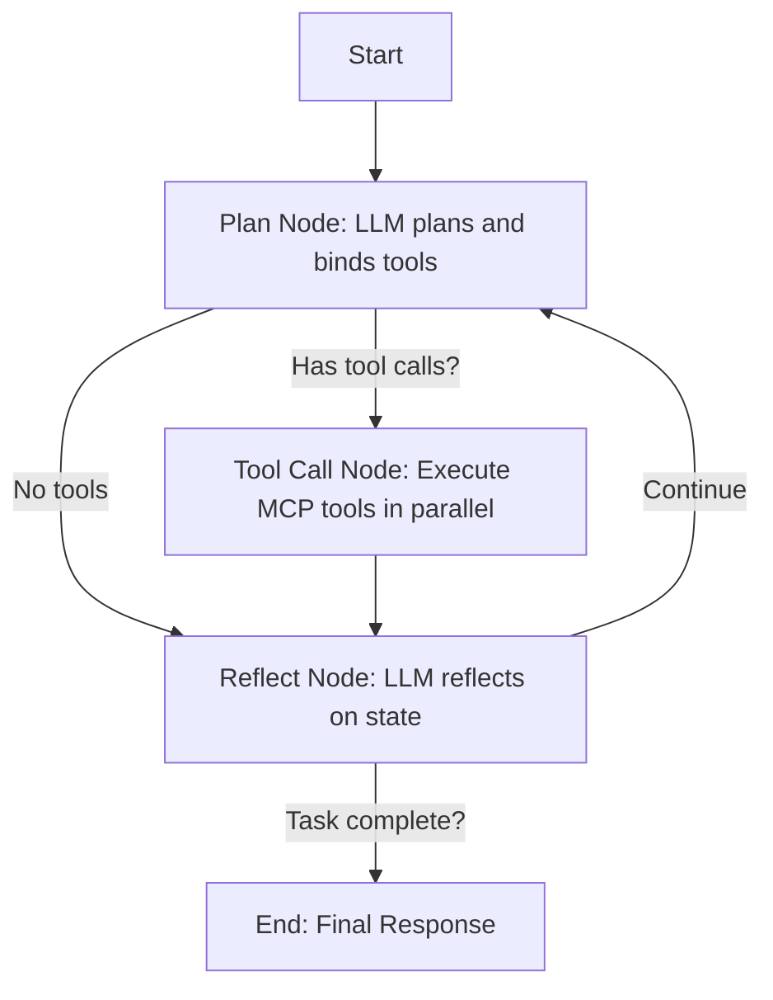
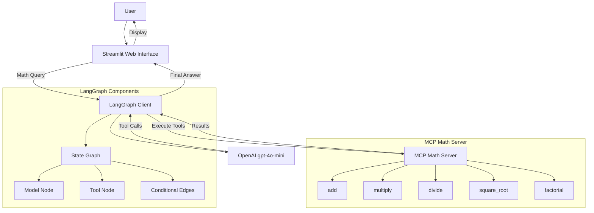
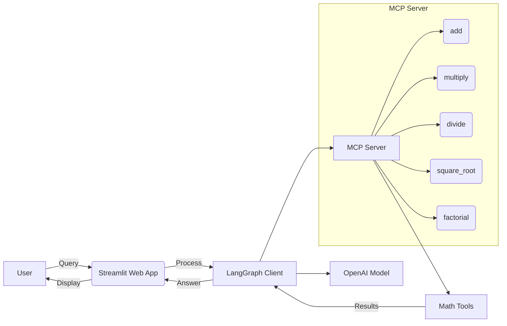
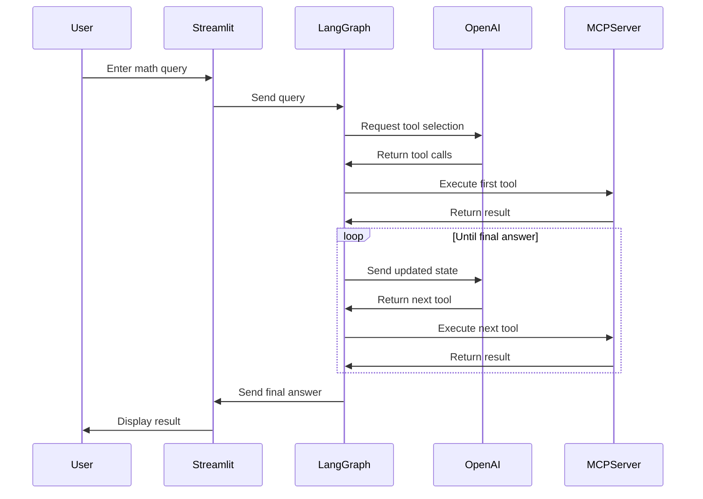

नीचे मैं LangGraph का उपयोग करके एक agentic AI workflow का Python code लिख रहा हूं। यह code पिछले context के आधार पर MCP servers (weather, math, JIRA, ServiceNow, Tavily) को integrate करता है, जहां agent planning, tool calling, और reflection करता है। Code LangChain और LangGraph पर आधारित है, जैसा कि web search results से उदाहरणों में दिखाया गया है (जैसे Medium articles और RealPython tutorial से inspiration लिया गया है)।

### Agentic Code (host_app.py)
```python
from langchain_mcp_adapters.client import MultiServerMCPClient
from langgraph.graph import StateGraph, END
from langgraph.prebuilt import ToolNode, tools_condition
from langchain_openai import ChatOpenAI
from langchain_core.messages import AIMessage, HumanMessage, SystemMessage
from typing import TypedDict, List, Any
import asyncio
import os
from dotenv import load_dotenv

load_dotenv()

llm = ChatOpenAI(model="gpt-4o", api_key=os.getenv("OPENAI_API_KEY"))

# MCP Servers Configuration (from previous context)
servers = {
    "weather": {
        "url": "http://localhost:8001/mcp",
        "transport": "streamable_http"
    },
    "math": {
        "command": "python math_server.py",
        "transport": "stdio"
    },
    "jira_atlassian": {
        "command": "docker",
        "args": [
            "run", "-i", "--rm",
            "-e", "JIRA_URL",
            "-e", "JIRA_USERNAME",
            "-e", "JIRA_API_TOKEN",
            "ghcr.io/sooperset/mcp-atlassian:latest"
        ],
        "env": {
            "JIRA_URL": os.getenv("JIRA_URL", "https://your-instance.atlassian.net"),
            "JIRA_USERNAME": os.getenv("JIRA_USERNAME", "your-email@example.com"),
            "JIRA_API_TOKEN": os.getenv("JIRA_API_TOKEN", "your-api-token-here")
        },
        "transport": "stdio"
    },
    "servicenow": {
        "command": "python",
        "args": ["-m", "servicenow_mcp.cli"],
        "env": {
            "SERVICENOW_INSTANCE_URL": os.getenv("SERVICENOW_INSTANCE_URL", "https://your-instance.service-now.com"),
            "SERVICENOW_USERNAME": os.getenv("SERVICENOW_USERNAME", "your-username"),
            "SERVICENOW_PASSWORD": os.getenv("SERVICENOW_PASSWORD", "your-password")
        },
        "transport": "stdio"
    },
    "tavily": {
        "url": f"https://mcp.tavily.com/mcp/?tavilyApiKey={os.getenv('TAVILY_API_KEY')}",
        "transport": "streamable_http"
    }
}

client = MultiServerMCPClient(servers)

class AgentState(TypedDict):
    messages: List[Any]

async def plan_node(state: AgentState):
    tools = await client.get_tools()
    system_prompt = SystemMessage(
        content="You are an agentic AI. Plan the next steps based on the query and available tools (weather, math, JIRA, ServiceNow, Tavily). Call tools if needed."
    )
    response = await llm.bind_tools(tools).ainvoke([system_prompt] + state["messages"])
    return {"messages": state["messages"] + [response]}

async def tool_call_node(state: AgentState):
    tools = await client.get_tools()
    tool_node = ToolNode(tools)
    return tool_node.invoke(state)

async def reflect_node(state: AgentState):
    system_prompt = SystemMessage(
        content="Reflect on tool results and previous messages. If task complete, say 'The task is complete: [final answer]'. Else, say 'Continue: [next plan]'."
    )
    response = await llm.ainvoke([system_prompt] + state["messages"])
    return {"messages": state["messages"] + [response]}

def reflect_condition(state: AgentState):
    last_message = state["messages"][-1]
    if "complete" in last_message.content.lower():
        return END
    return "plan"

# Build Graph
graph = StateGraph(AgentState)
graph.add_node("plan", plan_node)
graph.add_node("tool_call", tool_call_node)
graph.add_node("reflect", reflect_node)
graph.set_entry_point("plan")
graph.add_conditional_edges("plan", tools_condition, {"tools": "tool_call", "end": "reflect"})
graph.add_edge("tool_call", "reflect")
graph.add_conditional_edges("reflect", reflect_condition, {"plan": "plan", END: END})
agent = graph.compile()

async def main(query: str):
    inputs = {"messages": [HumanMessage(content=query)]}
    result = await agent.ainvoke(inputs)
    final_msg = result["messages"][-1].content
    print("Final Response:", final_msg)

# Example Run
if __name__ == "__main__":
    asyncio.run(main("Get weather in NY and create JIRA ticket if rainy."))
```

यह code एक cyclic graph बनाता है जहां agent plan करता है, tools call करता है (parallel nếu multiple), reflect करता है, और loop करता है जब तक task complete नहीं होता। Sources: , , ,  से inspired.

### Output Flow Visualization
LangGraph workflows graphs के रूप में visualize होते हैं (nodes: plan, tool_call, reflect; edges: conditional loops)। नीचे एक Mermaid diagram है जो flow दिखाता है (web search से inspired, जैसे  में)।


```python

### Proper Example Dry Run with Responses (Handling Each Case/Scenario)
Dry run मतलब step-by-step simulation बिना actual execution के। मैं विभिन्न scenarios के लिए simulate कर रहा हूं, assuming LLM responses (real में LLM generate करेगा)। Sources: , ,  से flow inspired.

#### Scenario 1: Simple Query, No Tools Needed (Direct Answer)
- **Query**: "What is 2+2?"
- **Step 1: Plan Node**
  - State: {"messages": [Human("What is 2+2?")]}
  - LLM Response: AIMessage("No tools needed. Answer is 4.")
  - No tool_calls → Go to Reflect.
- **Step 2: Reflect Node**
  - LLM Response: AIMessage("The task is complete: 4")
  - "complete" detected → End.
- **Final Response**: "The task is complete: 4"
- **Handling**: Quick exit for simple cases, no loop.

#### Scenario 2: Query with Single Tool Call (e.g., Weather)
- **Query**: "Get weather in NY"
- **Step 1: Plan Node**
  - State: {"messages": [Human("Get weather in NY")]}
  - LLM Response: AIMessage(tool_calls=[{"name": "get_weather", "args": {"city": "NY"}}])
  - Has tool_calls → Go to Tool Call.
- **Step 2: Tool Call Node**
  - Executes get_weather → ToolMessage("Sunny, 20°C")
  - State updated with ToolMessage.
- **Step 3: Reflect Node**
  - LLM Response: AIMessage("The task is complete: Weather in NY is Sunny, 20°C")
  - "complete" → End.
- **Final Response**: "The task is complete: Weather in NY is Sunny, 20°C"
- **Handling**: Single tool use, no multi-turn.

#### Scenario 3: Multi-Turn with Multiple Tools and Loop (Complex Task)
- **Query**: "Get weather in NY, if rainy create JIRA ticket, then search AI news"
- **Step 1: Plan Node**
  - LLM Response: AIMessage(tool_calls=[{"name": "get_weather", "args": {"city": "NY"}}, {"name": "search", "args": {"query": "Latest AI news"}}])  // Parallel calls
  - Go to Tool Call.
- **Step 2: Tool Call Node**
  - Results: ToolMessage("Rainy, 15°C"), ToolMessage("AI news: Grok 4 released")
- **Step 3: Reflect Node**
  - LLM Response: AIMessage("Continue: Weather is rainy, so create JIRA ticket.")
  - "continue" → Loop back to Plan.
- **Step 4: Plan Node (Loop)**
  - Updated state with previous messages.
  - LLM Response: AIMessage(tool_calls=[{"name": "create_issue", "args": {"project_key": "PROJ", "summary": "Rainy in NY"}}])
  - Go to Tool Call.
- **Step 5: Tool Call Node**
  - Result: ToolMessage("Ticket created: JIRA-123")
- **Step 6: Reflect Node**
  - LLM Response: AIMessage("The task is complete: Weather rainy, ticket JIRA-123, AI news: Grok 4 released.")
  - End.
- **Final Response**: "The task is complete: Weather rainy, ticket JIRA-123, AI news: Grok 4 released."
- **Handling**: Parallel tools, looping for sequential dependencies, multi-turn reasoning.

#### Scenario 4: Error Handling (Tool Failure)
- **Query**: "Add 2 and 'abc'" (Invalid math)
- **Step 1: Plan Node**
  - LLM Response: AIMessage(tool_calls=[{"name": "add", "args": {"a": 2, "b": "abc"}}])
- **Step 2: Tool Call Node**
  - Fails: ToolMessage("Error: Invalid type for add")
- **Step 3: Reflect Node**
  - LLM Response: AIMessage("Continue: Fix input and retry.")
- **Step 4: Plan Node (Loop)**
  - LLM Response: AIMessage("No tools. Invalid query.")
- **Step 5: Reflect Node**
  - AIMessage("The task is complete: Error - cannot add number and string.")
  - End.
- **Final Response**: "The task is complete: Error - cannot add number and string."
- **Handling**: Reflection detects error, agent recovers or ends gracefully.

#### Scenario 5: No Resolution After Loops (Max Loops, though not coded; assume limit)
- **Query**: Ambiguous endless task.
- **Handling**: In practice, add checkpointer or max_iterations in graph.compile(checkpointer=...). Here, reflection eventually completes or user intervenes.
```

```PYTHON
# OpenAI
OPENAI_API_KEY=your_openai_api_key_here

# JIRA Atlassian
JIRA_URL=https://your-instance.atlassian.net
JIRA_USERNAME=your-email@example.com
JIRA_API_TOKEN=your-api-token-here

# ServiceNow
SERVICENOW_INSTANCE_URL=https://your-instance.service-now.com
SERVICENOW_USERNAME=your-username
SERVICENOW_PASSWORD=your-password

# Tavily
TAVILY_API_KEY=your_tavily_api_key_here

# OpenWeatherMap (for weather server)
OWM_API_KEY=your_openweathermap_api_key
```

# Updated Multiple MCP Implementation with LangGraph Integration

Below is the complete code from the previous setup, incorporating LangGraph for building an agentic workflow. This includes all MCP servers (weather, math, JIRA Atlassian, ServiceNow, Tavily) and the host application with a custom LangGraph agent. The agent handles planning, tool calling, and reflection using the MCP tools.

### weather_server.py
```python
from fastmcp import FastMCP
import httpx

mcp = FastMCP(name="WeatherServer")

@mcp.tool
async def get_weather(city: str) -> str:
    """Get weather for a city."""
    async with httpx.AsyncClient() as client:
        resp = await client.get(f"https://api.weather.example.com/{city}")  # Replace with real API
        return resp.text

if __name__ == "__main__":
    mcp.run(transport="http", host="0.0.0.0", port=8001)
```

### math_server.py
```python
from fastmcp import FastMCP

mcp = FastMCP(name="MathServer")

@mcp.tool
def add(a: int, b: int) -> int:
    """Add two numbers."""
    return a + b

if __name__ == "__main__":
    mcp.run()
```

### host_app.py (With LangGraph Agent)
```python
from langchain_mcp_adapters.client import MultiServerMCPClient
from langgraph.graph import StateGraph, END
from langchain_openai import ChatOpenAI
from langchain_core.messages import HumanMessage, SystemMessage
from typing import TypedDict, List, Any
import asyncio
import os
from dotenv import load_dotenv

load_dotenv()

llm = ChatOpenAI(model="gpt-4", api_key=os.getenv("OPENAI_API_KEY"))

servers = {
    "weather": {
        "url": "http://localhost:8001/mcp",
        "transport": "streamable_http"
    },
    "math": {
        "command": "python math_server.py",
        "transport": "stdio"
    },
    "jira_atlassian": {
        "command": "docker",
        "args": [
            "run", "-i", "--rm",
            "-e", "JIRA_URL",
            "-e", "JIRA_USERNAME",
            "-e", "JIRA_API_TOKEN",
            "ghcr.io/sooperset/mcp-atlassian:latest"
        ],
        "env": {
            "JIRA_URL": os.getenv("JIRA_URL", "https://your-instance.atlassian.net"),
            "JIRA_USERNAME": os.getenv("JIRA_USERNAME", "your-email@example.com"),
            "JIRA_API_TOKEN": os.getenv("JIRA_API_TOKEN", "your-api-token-here")
        },
        "transport": "stdio"
    },
    "servicenow": {
        "command": "python",
        "args": ["-m", "servicenow_mcp.cli"],
        "env": {
            "SERVICENOW_INSTANCE_URL": os.getenv("SERVICENOW_INSTANCE_URL", "https://your-instance.service-now.com"),
            "SERVICENOW_USERNAME": os.getenv("SERVICENOW_USERNAME", "your-username"),
            "SERVICENOW_PASSWORD": os.getenv("SERVICENOW_PASSWORD", "your-password")
        },
        "transport": "stdio"
    },
    "tavily": {
        "url": f"https://mcp.tavily.com/mcp/?tavilyApiKey={os.getenv('TAVILY_API_KEY')}",
        "transport": "streamable_http"
    }
}

client = MultiServerMCPClient(servers)

class AgentState(TypedDict):
    messages: List[HumanMessage]
    tool_results: List[Any]

async def plan_node(state: AgentState):
    prompt = SystemMessage(content="Plan the next action based on the query and available tools.")
    response = await llm.ainvoke(state["messages"] + [prompt])
    state["messages"].append(response)
    return state

async def tool_call_node(state: AgentState):
    last_msg = state["messages"][-1].content
    results = []
    if "jira" in last_msg.lower():
        result = await client.call_tool("create_issue", {"project_key": "PROJ", "summary": "Test", "description": last_msg})
        results.append(result)
    if "servicenow" in last_msg.lower():
        result = await client.call_tool("create_incident", {"short_description": "Test", "description": last_msg})
        results.append(result)
    if "tavily" in last_msg.lower():
        result = await client.call_tool("search", {"query": "Latest AI news"})
        results.append(result)
    # Add logic for weather/math as needed
    state["tool_results"].extend(results)
    return state

async def reflect_node(state: AgentState):
    prompt = SystemMessage(content=f"Reflect on results: {state['tool_results']}. Is the task complete?")
    response = await llm.ainvoke(state["messages"] + [prompt])
    state["messages"].append(response)
    if "complete" in response.content.lower():
        return "end"
    return "continue"

graph = StateGraph(AgentState)
graph.add_node("plan", plan_node)
graph.add_node("tool_call", tool_call_node)
graph.add_node("reflect", reflect_node)
graph.add_edge("plan", "tool_call")
graph.add_edge("tool_call", "reflect")
graph.add_conditional_edges("reflect", reflect_node, {"continue": "plan", "end": END})
graph.set_entry_point("plan")

agent = graph.compile()

async def main():
    tools = await client.get_tools()
    print("Available Tools:", [tool.name for tool in tools])
    inputs = {"messages": [HumanMessage(content="Create a JIRA ticket for weather issue in NY and search latest news via Tavily")], "tool_results": []}
    result = await agent.ainvoke(inputs)
    print("Agent Final Result:", result["tool_results"])

asyncio.run(main())
```

# Key Components:
- **call_model Node**: LLM decision hub (routes to tools or direct answer)
- **tools Node**: Executes MCP server commands
- **State Management**: Maintains conversation history
- **Feedback Loop**: Allows chaining multiple tool calls
- **Stdio Transport**: JSON-RPC communication via stdin/stdout


****


****


# MCP Weather API

### Step 4: Execution Flow (Per Query)
1. **Initial State Creation**  
   `{"messages": [HumanMessage(content=user_question)]}`

2. **call_model Node Execution**  
   - LLM processes messages
   - Binds available tools
   - Returns either:
     - Direct answer (`AIMessage` with content)
     - Tool call request (`AIMessage` with tool_calls)

3. **Condition Check**  
   - `tools_condition` checks last message:
     - If `tool_calls` exist → go to "tools" node
     - No tool calls → return final response

4. **tools Node Execution**  
   - For each tool call in `tool_calls`:
     - Identify required tool (weather/calculator)
     - Execute via MCP client
     - Convert result to `ToolMessage`
   - Append `ToolMessage` to state

5. **Feedback Loop**  
   - Return to "call_model" with updated state
   - LLM processes tool results
   - Repeat steps 2-4 until no more tool calls needed

6. **Final Response**  
   - Last `AIMessage` contains answer
   - Returned to user

### Step 5: Tool Execution Details
**For Weather Requests:**
1. MCP client sends JSON-RPC to `mcp-weather.exe` via stdio
2. Weather server calls OpenWeatherMap API
3. Returns structured weather data

**For Calculations:**
1. MCP client sends JSON-RPC to calculator module
2. Calculator evaluates expression
3. Returns numeric result

### Step 6: Termination
- Loop continues until user enters "exit" or "quit"
- All processes cleanly shut down

### Key Characteristics:
1. **State Preservation**: Full message history maintained throughout
2. **Dynamic Tool Handling**: Automatically routes to appropriate tool
3. **Multi-turn Capability**: Can chain multiple tool calls
4. **Synchronous Execution**: Each step completes before next begins
5. **Error Handling**: Built-in LangGraph error management


### Step 1: Initialization
1. Load environment variables
2. Create `MultiServerMCPClient` with:
   - Weather server configuration (`mcp-weather.exe`)
   - Calculator server configuration (`mcp_server_calculator`)
3. Fetch available tools using `client.get_tools()`
4. Initialize ChatOpenAI model (GPT-4o-mini)
5. Build LangGraph state machine

### Step 2: Graph Construction
```python
builder = StateGraph(MessagesState)
builder.add_node("call_model", call_model)   # LLM processing
builder.add_node("tools", ToolNode(tools))   # Tool execution
builder.add_edge(START, "call_model")        # Start with LLM
builder.add_conditional_edges(               # Decide next step
    "call_model", 
    tools_condition
)
builder.add_edge("tools", "call_model")      # Loop back to LLM
graph = builder.compile()                    # Finalize graph
```

### Step 3: User Interaction Loop
```python
while True:
    user_question = input()
    if exit_command: break
    result = await graph.ainvoke({"messages": user_question})
    print(final_response)
```


****


****


****


****

****


### LangGraph Workflow Step-by-Step with Code

#### Step 1: Environment Setup & Initialization
```python
import asyncio
import os
from dotenv import load_dotenv
from langchain_openai import ChatOpenAI
from langchain_mcp_adapters.client import MultiServerMCPClient
from langgraph.graph import StateGraph, MessagesState, START
from langgraph.prebuilt import ToolNode, tools_condition

# Load environment variables
load_dotenv()

async def main():
    # Get API keys
    openai_key = os.getenv("OPENAI_API_KEY")
    owm_key = os.getenv("OWM_API_KEY")
    
    # Initialize MCP client with servers
    client = MultiServerMCPClient({
        "weather": {
            "transport": "stdio",
            "command": "mcp-weather.exe",
            "env": {"OWM_API_KEY": owm_key}  
        },
        "calculator": {
            "transport": "stdio",
            "command": "python",
            "args": ["-m", "mcp_server_calculator"]
        }
    })
    
    # STEP 1: Fetch available tools
    tools = await client.get_tools()
    
    # Initialize LLM
    model = ChatOpenAI(model="gpt-4o-mini", api_key=openai_key)
```

#### Step 2: Graph Construction
```python
    # Define LLM processing node
    def call_model(state: MessagesState):
        # STEP 2: Process input and decide tool usage
        response = model.bind_tools(tools).invoke(state["messages"])
        return {"messages": response}
    
    # STEP 3: Build state graph
    builder = StateGraph(MessagesState)
    
    # Add nodes
    builder.add_node("call_model", call_model)  # Decision-making node
    builder.add_node("tools", ToolNode(tools))   # Tool execution node
    
    # Set connections
    builder.add_edge(START, "call_model")        # Start with LLM
    
    # STEP 4: Conditional routing
    builder.add_conditional_edges(
        "call_model",
        tools_condition,  # Checks if tool_calls exist
        {
            "call_tools": "tools",  # Route to tools if needed
            "end": END              # End if final response
        }
    )
    
    # Feedback loop
    builder.add_edge("tools", "call_model")  # Return to LLM after tools
    
    # Compile graph
    graph = builder.compile()
```

#### Step 3: Execution Flow (Per User Query)
```python
    while True:
        user_input = input("\nAsk me anything → ")
        
        if user_input.lower() in ["exit", "quit"]:
            break
        
        # STEP 5: Initialize state
        initial_state = {"messages": [{"role": "user", "content": user_input}]}
        
        # Execute graph
        result = await graph.ainvoke(initial_state)
        
        # STEP 6: Extract final response
        final_message = result["messages"][-1]
        print(f"\nAnswer: {final_message.content}")

if __name__ == "__main__":
    asyncio.run(main())
```

### Key Execution Steps Explained with Code

#### 1. Tool Execution (Inside `ToolNode`)
```python
# Simplified ToolNode implementation
async def execute_tool(tool_name: str, arguments: dict):
    # STEP 4a: Route to correct server
    if tool_name == "get_current_weather":
        # Call weather server via stdio
        result = await client.invoke("weather", arguments)
    elif tool_name == "calculate":
        # Call calculator server
        result = await client.invoke("calculator", arguments)
    
    # STEP 4b: Create ToolMessage
    return ToolMessage(
        content=str(result),
        tool_call_id=tool_call_id
    )
```

#### 2. Conditional Routing Logic
```python
def tools_condition(state: MessagesState):
    # STEP 3: Check last message for tool_calls
    last_message = state["messages"][-1]
    
    if hasattr(last_message, "tool_calls") and last_message.tool_calls:
        # Route to tools node if tool calls exist
        return "call_tools"
    else:
        # End graph if no tool calls
        return "end"
```

#### 3. Multi-Turn Tool Chaining
```python
# Example state evolution:
initial_state = {
    "messages": [
        {"role": "user", "content": "What's 2^8? Then what's the weather in Paris?"}
    ]
}

# After first LLM call:
state_after_llm = {
    "messages": [
        user_message,
        AIMessage(tool_calls=[{"name": "calculate", "args": {"expression": "2^8"}}])
    ]
}

# After tool execution:
state_after_tool = {
    "messages": [
        user_message,
        ai_message,
        ToolMessage(content="256", tool_call_id="call_123")
    ]
}

# Final LLM response:
final_state = {
    "messages": [
        ...previous_messages,
        AIMessage(content="First calculation: 256. Now fetching Paris weather...")
    ]
}
```

### Full Sequence for a Weather Query
1. User input: `"What's the temperature in London?"`
2. State initialized: `{"messages": [HumanMessage(content="...")]}`
3. `call_model` node:
   ```python
   # LLM returns:
   AIMessage(
       content="",
       tool_calls=[{
           "name": "get_current_weather",
           "args": {"location": "London"}
       }]
   )
   ```
4. `tools_condition` detects tool calls → routes to `tools` node
5. `ToolNode` executes weather server call
6. State updated with `ToolMessage` containing weather data
7. Loop back to `call_model` node
8. LLM generates final response: `"Current temperature in London is 18°C"`
9. No tool calls → return final response


****
****
****
****


## Custom MCP Math Server with LangGraph and Streamlit


I apologize for the rendering issue. Let me provide a simplified and more compatible Mermaid diagram that should work reliably:



### Simplified Architecture Diagram:


### Sequence Flow:


### Key Components Explained:
1. **Streamlit Web App**: 
   - Single-page web interface
   - Text input and button for queries
   - Displays results

2. **LangGraph Client**:
   - Manages state machine
   - Coordinates between OpenAI and MCP
   - Handles tool execution flow

3. **OpenAI Model**:
   - gpt-4o-mini model
   - Decides which tools to use
   - Parses natural language queries

4. **MCP Math Server**:
   - HTTP server on port 8000
   - Provides mathematical operations as tools
   - Validates inputs (e.g., prevent division by zero)

5. **Math Tools**:
   - add: Integer addition
   - multiply: Integer multiplication
   - divide: Float division with zero check
   - square_root: Non-negative roots
   - factorial: Non-negative integers

This simplified diagram should render properly in most Mermaid implementations while still capturing the core architecture and workflow of your custom MCP math system. The sequence diagram specifically shows the step-by-step flow for handling a query like "(3 + 5) × 12".

---

To build a custom MCP (Multi-Chain Protocol) server with LangGraph and Streamlit, as outlined in the provided code and setup instructions, follow these steps. The setup includes a custom MCP server for mathematical operations, a LangGraph-based client, and a Streamlit web interface, as demonstrated in the Hindi video tutorial you referenced. Below is a concise guide to set up, run, and understand the system, addressing the code and environment details you provided.

### Prerequisites
1. **Python Environment**: Ensure Python 3.8+ is installed.
2. **Dependencies**: Install the required packages using the command:
   ```bash
   pip install python-dotenv langchain-mcp-adapters langgraph langchain-openai mcp streamlit
   ```
3. **Environment Variables**: Create a `.env` file in the project directory with your OpenAI API key:
   ```plaintext
   OPENAI_API_KEY=your_openai_api_key_here
   ```
4. **Files**: Create three Python files based on the provided code:
   - `custom_mcp_server.py`: Defines the MCP server with math tools.
   - `mcp_client_langgraph.py`: Runs the LangGraph client for command-line interaction.
   - `web_app.py`: Provides the Streamlit web interface.

### Step-by-Step Setup

#### 1. **Create the MCP Server (`custom_mcp_server.py`)**
This script sets up a FastMCP server named "Math" with tools for basic mathematical operations.

```python
from mcp.server.fastmcp import FastMCP
import math

mcp = FastMCP("Math")

@mcp.tool()
def add(a: int, b: int) -> int:
    """Add two numbers"""
    return a + b

@mcp.tool()
def multiply(a: int, b: int) -> int:
    """Multiply two numbers"""
    return a * b

@mcp.tool()
def divide(a: float, b: float) -> float:
    """Divide a by b. Raises error if b is zero."""
    if b == 0:
        raise ValueError("Division by zero is not allowed.")
    return a / b

@mcp.tool()
def square_root(x: float) -> float:
    """Return the square root of x."""
    if x < 0:
        raise ValueError("Cannot take square root of a negative number.")
    return math.sqrt(x)

@mcp.tool()
def factorial(n: int) -> int:
    """Return factorial of n."""
    if n < 0:
        raise ValueError("Factorial is not defined for negative numbers.")
    return math.factorial(n)

if __name__ == "__main__":
    mcp.run(transport="streamable-http")
```

**Explanation**:
- The `FastMCP` class creates a server named "Math".
- Decorated functions (`@mcp.tool()`) define tools for addition, multiplication, division, square root, and factorial.
- The server runs over HTTP (`streamable-http`) on `http://127.0.0.1:8000/mcp`.

#### 2. **Create the LangGraph Client (`mcp_client_langgraph.py`)**
This script uses LangGraph to interact with the MCP server, leveraging OpenAI’s `gpt-4o-mini` model to process queries.

```python
import asyncio
from langchain_mcp_adapters.client import MultiServerMCPClient
from langchain_openai import ChatOpenAI
from langgraph.graph import StateGraph, MessagesState, START, END
from langgraph.prebuilt import ToolNode
import os
from dotenv import load_dotenv

load_dotenv()

async def main():
    openai_key = os.getenv("OPENAI_API_KEY")
    model = ChatOpenAI(model="gpt-4o-mini", api_key=openai_key)

    client = MultiServerMCPClient(
        {
            "math": {
                "transport": "streamable-http",
                "url": "http://127.0.0.1:8000/mcp"
            }
        }
    )

    tools = await client.get_tools()
    model_with_tools = model.bind_tools(tools)
    tool_node = ToolNode(tools)

    def should_continue(state: MessagesState):
        messages = state["messages"]
        last_message = messages[-1]
        return "tools" if last_message.tool_calls else END

    async def call_model(state: MessagesState):
        messages = state["messages"]
        response = await model_with_tools.ainvoke(messages)
        return {"messages": [response]}

    builder = StateGraph(MessagesState)
    builder.add_node("call_model", call_model)
    builder.add_node("tools", tool_node)
    builder.add_edge(START, "call_model")
    builder.add_conditional_edges("call_model", should_continue)
    builder.add_edge("tools", "call_model")

    graph = builder.compile()
    result = await graph.ainvoke({"messages": [{"role": "user", "content": "what's (3 + 5) x 12?"}]})
    print(result["messages"][-1].content)

if __name__ == "__main__":
    asyncio.run(main())
```

**Explanation**:
- **Environment**: Loads the OpenAI API key from the `.env` file.
- **Client**: Connects to the MCP server at `http://127.0.0.1:8000/mcp` using `MultiServerMCPClient`.
- **LangGraph**: Creates a state graph with two nodes:
  - `call_model`: Invokes the OpenAI model with bound tools.
  - `tools`: Executes tool calls using `ToolNode`.
- **Flow**: The graph starts at `call_model`, checks for tool calls (`should_continue`), and routes to `tools` or ends at `END`.
- **Example Query**: Computes `(3 + 5) x 12` by calling the `add` and `multiply` tools, outputting the result (e.g., `96`).

#### 3. **Create the Streamlit Web App (`web_app.py`)**
This script provides a web interface using Streamlit to interact with the MCP server.

```python
import asyncio
import streamlit as st
from langchain_mcp_adapters.client import MultiServerMCPClient
from langchain_openai import ChatOpenAI
from langgraph.graph import StateGraph, MessagesState, START, END
from langgraph.prebuilt import ToolNode
import os
from dotenv import load_dotenv

load_dotenv()

async def run_mcp_query(user_input):
    openai_key = os.getenv("OPENAI_API_KEY")
    model = ChatOpenAI(model="gpt-4o-mini", api_key=openai_key)

    client = MultiServerMCPClient(
        {
            "math": {
                "transport": "streamable-http",
                "url": "http://127.0.0.1:8000/mcp"
            }
        }
    )

    tools = await client.get_tools()
    model_with_tools = model.bind_tools(tools)
    tool_node = ToolNode(tools)

    def should_continue(state: MessagesState):
        messages = state["messages"]
        last_message = messages[-1]
        return "tools" if last_message.tool_calls else END

    async def call_model(state: MessagesState):
        messages = state["messages"]
        response = await model_with_tools.ainvoke(messages)
        return {"messages": [response]}

    builder = StateGraph(MessagesState)
    builder.add_node("call_model", call_model)
    builder.add_node("tools", tool_node)
    builder.add_edge(START, "call_model")
    builder.add_conditional_edges("call_model", should_continue)
    builder.add_edge("tools", "call_model")

    graph = builder.compile()
    result = await graph.ainvoke({"messages": [{"role": "user", "content": user_input}]})
    last_msg = result["messages"][-1].content
    return last_msg if isinstance(last_msg, str) else str(last_msg)

def main():
    st.set_page_config(page_title="MCP Math Chat", page_icon="🧮")
    st.title("🧮 MCP Math Chat (Streamlit)")

    user_input = st.text_input("Ask me something math-related:")
    if st.button("Send") and user_input.strip():
        with st.spinner("Thinking..."):
            answer = asyncio.run(run_mcp_query(user_input))
            st.success(answer)

if __name__ == "__main__":
    main()
```

**Explanation**:
- **Streamlit UI**: Creates a simple web interface with a text input and a "Send" button.
- **Query Processing**: The `run_mcp_query` function mirrors the LangGraph client’s logic, connecting to the MCP server and processing user input.
- **Output**: Displays the result (e.g., `96` for `(3 + 5) x 12`) in the Streamlit app.

### Running the Application

1. **Start the MCP Server**:
   - Open a terminal and navigate to the project directory.
   - Run:
     ```bash
     python custom_mcp_server.py
     ```
   - This starts the FastMCP server on `http://127.0.0.1:8000/mcp`.

2. **Run the Client (Choose One)**:
   - **Command-Line Client**:
     - Open a second terminal.
     - Run:
       ```bash
       python mcp_client_langgraph.py
       ```
     - This executes the query `(3 + 5) x 12` and prints the result (e.g., `96`).
   - **Streamlit Web App**:
     - Open a second terminal.
     - Run:
       ```bash
       streamlit run web_app.py
       ```
     - Open the provided URL (e.g., `http://localhost:8501`) in a browser, enter a math query (e.g., `what's (3 + 5) x 12?`), and click "Send" to see the result.

### How It Works
- **MCP Server**: Exposes math tools (add, multiply, etc.) via HTTP.
- **LangGraph Client**: Uses a state graph to:
  1. Send the user query to the OpenAI model (`gpt-4o-mini`).
  2. Parse tool calls (e.g., `add(3, 5)` and `multiply(result, 12)`).
  3. Execute tools via the MCP client and return the final answer.
- **Streamlit App**: Wraps the LangGraph client in a web interface for user-friendly interaction.

### Troubleshooting
- **Module Not Found**: Ensure all dependencies are installed (`pip install -r requirements.txt` if you create a `requirements.txt` with the listed packages).
- **API Key Error**: Verify the `OPENAI_API_KEY` is correctly set in the `.env` file.
- **Server Not Running**: Ensure the MCP server is active before running the client or Streamlit app.
- **Port Conflict**: If port `8000` is in use, modify the server URL in the client scripts or stop conflicting processes.

### Example Output
For the query `(3 + 5) x 12`:
- **Command-Line Client**: Prints `96` in the terminal.
- **Streamlit App**: Displays `96` in the web interface.

### Notes
- The commented-out `stdio` transport option in `mcp_client_langgraph.py` is an alternative to `streamable-http`. Use it if you prefer local process communication over HTTP, but update the `command` and `args` to point to `custom_mcp_server.py`’s absolute path.
- The video tutorial (in Hindi) likely provides additional context on setup or use cases. If you need specific clarifications from the video, please provide details or timestamps.
- For further customization (e.g., adding more tools or modifying the UI), extend the `mcp.tool()` functions or Streamlit components.

