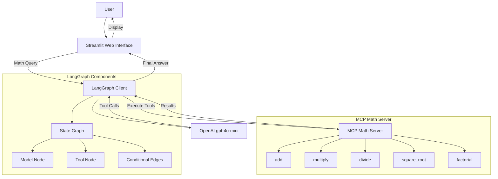
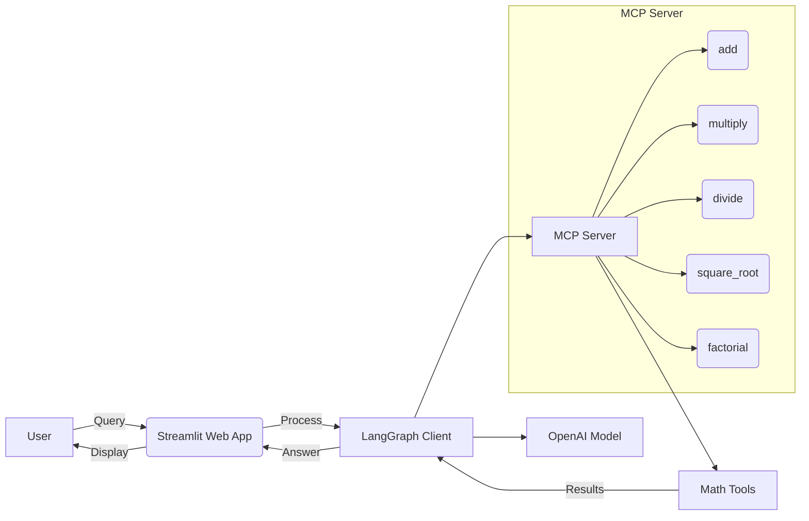
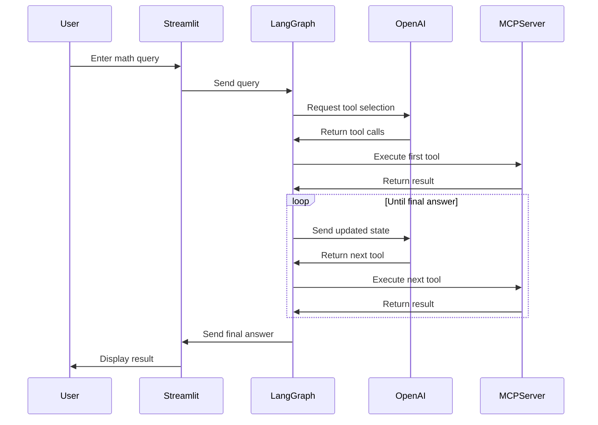

## Custom MCP Math Server with LangGraph and Streamlit


I apologize for the rendering issue. Let me provide a simplified and more compatible Mermaid diagram that should work reliably:



### Simplified Architecture Diagram:


### Sequence Flow:


### Key Components Explained:
1. **Streamlit Web App**: 
   - Single-page web interface
   - Text input and button for queries
   - Displays results

2. **LangGraph Client**:
   - Manages state machine
   - Coordinates between OpenAI and MCP
   - Handles tool execution flow

3. **OpenAI Model**:
   - gpt-4o-mini model
   - Decides which tools to use
   - Parses natural language queries

4. **MCP Math Server**:
   - HTTP server on port 8000
   - Provides mathematical operations as tools
   - Validates inputs (e.g., prevent division by zero)

5. **Math Tools**:
   - add: Integer addition
   - multiply: Integer multiplication
   - divide: Float division with zero check
   - square_root: Non-negative roots
   - factorial: Non-negative integers

This simplified diagram should render properly in most Mermaid implementations while still capturing the core architecture and workflow of your custom MCP math system. The sequence diagram specifically shows the step-by-step flow for handling a query like "(3 + 5) × 12".

---

To build a custom MCP (Multi-Chain Protocol) server with LangGraph and Streamlit, as outlined in the provided code and setup instructions, follow these steps. The setup includes a custom MCP server for mathematical operations, a LangGraph-based client, and a Streamlit web interface, as demonstrated in the Hindi video tutorial you referenced. Below is a concise guide to set up, run, and understand the system, addressing the code and environment details you provided.

### Prerequisites
1. **Python Environment**: Ensure Python 3.8+ is installed.
2. **Dependencies**: Install the required packages using the command:
   ```bash
   pip install python-dotenv langchain-mcp-adapters langgraph langchain-openai mcp streamlit
   ```
3. **Environment Variables**: Create a `.env` file in the project directory with your OpenAI API key:
   ```plaintext
   OPENAI_API_KEY=your_openai_api_key_here
   ```
4. **Files**: Create three Python files based on the provided code:
   - `custom_mcp_server.py`: Defines the MCP server with math tools.
   - `mcp_client_langgraph.py`: Runs the LangGraph client for command-line interaction.
   - `web_app.py`: Provides the Streamlit web interface.

### Step-by-Step Setup

#### 1. **Create the MCP Server (`custom_mcp_server.py`)**
This script sets up a FastMCP server named "Math" with tools for basic mathematical operations.

```python
from mcp.server.fastmcp import FastMCP
import math

mcp = FastMCP("Math")

@mcp.tool()
def add(a: int, b: int) -> int:
    """Add two numbers"""
    return a + b

@mcp.tool()
def multiply(a: int, b: int) -> int:
    """Multiply two numbers"""
    return a * b

@mcp.tool()
def divide(a: float, b: float) -> float:
    """Divide a by b. Raises error if b is zero."""
    if b == 0:
        raise ValueError("Division by zero is not allowed.")
    return a / b

@mcp.tool()
def square_root(x: float) -> float:
    """Return the square root of x."""
    if x < 0:
        raise ValueError("Cannot take square root of a negative number.")
    return math.sqrt(x)

@mcp.tool()
def factorial(n: int) -> int:
    """Return factorial of n."""
    if n < 0:
        raise ValueError("Factorial is not defined for negative numbers.")
    return math.factorial(n)

if __name__ == "__main__":
    mcp.run(transport="streamable-http")
```

**Explanation**:
- The `FastMCP` class creates a server named "Math".
- Decorated functions (`@mcp.tool()`) define tools for addition, multiplication, division, square root, and factorial.
- The server runs over HTTP (`streamable-http`) on `http://127.0.0.1:8000/mcp`.

#### 2. **Create the LangGraph Client (`mcp_client_langgraph.py`)**
This script uses LangGraph to interact with the MCP server, leveraging OpenAI’s `gpt-4o-mini` model to process queries.

```python
import asyncio
from langchain_mcp_adapters.client import MultiServerMCPClient
from langchain_openai import ChatOpenAI
from langgraph.graph import StateGraph, MessagesState, START, END
from langgraph.prebuilt import ToolNode
import os
from dotenv import load_dotenv

load_dotenv()

async def main():
    openai_key = os.getenv("OPENAI_API_KEY")
    model = ChatOpenAI(model="gpt-4o-mini", api_key=openai_key)

    client = MultiServerMCPClient(
        {
            "math": {
                "transport": "streamable-http",
                "url": "http://127.0.0.1:8000/mcp"
            }
        }
    )

    tools = await client.get_tools()
    model_with_tools = model.bind_tools(tools)
    tool_node = ToolNode(tools)

    def should_continue(state: MessagesState):
        messages = state["messages"]
        last_message = messages[-1]
        return "tools" if last_message.tool_calls else END

    async def call_model(state: MessagesState):
        messages = state["messages"]
        response = await model_with_tools.ainvoke(messages)
        return {"messages": [response]}

    builder = StateGraph(MessagesState)
    builder.add_node("call_model", call_model)
    builder.add_node("tools", tool_node)
    builder.add_edge(START, "call_model")
    builder.add_conditional_edges("call_model", should_continue)
    builder.add_edge("tools", "call_model")

    graph = builder.compile()
    result = await graph.ainvoke({"messages": [{"role": "user", "content": "what's (3 + 5) x 12?"}]})
    print(result["messages"][-1].content)

if __name__ == "__main__":
    asyncio.run(main())
```

**Explanation**:
- **Environment**: Loads the OpenAI API key from the `.env` file.
- **Client**: Connects to the MCP server at `http://127.0.0.1:8000/mcp` using `MultiServerMCPClient`.
- **LangGraph**: Creates a state graph with two nodes:
  - `call_model`: Invokes the OpenAI model with bound tools.
  - `tools`: Executes tool calls using `ToolNode`.
- **Flow**: The graph starts at `call_model`, checks for tool calls (`should_continue`), and routes to `tools` or ends at `END`.
- **Example Query**: Computes `(3 + 5) x 12` by calling the `add` and `multiply` tools, outputting the result (e.g., `96`).

#### 3. **Create the Streamlit Web App (`web_app.py`)**
This script provides a web interface using Streamlit to interact with the MCP server.

```python
import asyncio
import streamlit as st
from langchain_mcp_adapters.client import MultiServerMCPClient
from langchain_openai import ChatOpenAI
from langgraph.graph import StateGraph, MessagesState, START, END
from langgraph.prebuilt import ToolNode
import os
from dotenv import load_dotenv

load_dotenv()

async def run_mcp_query(user_input):
    openai_key = os.getenv("OPENAI_API_KEY")
    model = ChatOpenAI(model="gpt-4o-mini", api_key=openai_key)

    client = MultiServerMCPClient(
        {
            "math": {
                "transport": "streamable-http",
                "url": "http://127.0.0.1:8000/mcp"
            }
        }
    )

    tools = await client.get_tools()
    model_with_tools = model.bind_tools(tools)
    tool_node = ToolNode(tools)

    def should_continue(state: MessagesState):
        messages = state["messages"]
        last_message = messages[-1]
        return "tools" if last_message.tool_calls else END

    async def call_model(state: MessagesState):
        messages = state["messages"]
        response = await model_with_tools.ainvoke(messages)
        return {"messages": [response]}

    builder = StateGraph(MessagesState)
    builder.add_node("call_model", call_model)
    builder.add_node("tools", tool_node)
    builder.add_edge(START, "call_model")
    builder.add_conditional_edges("call_model", should_continue)
    builder.add_edge("tools", "call_model")

    graph = builder.compile()
    result = await graph.ainvoke({"messages": [{"role": "user", "content": user_input}]})
    last_msg = result["messages"][-1].content
    return last_msg if isinstance(last_msg, str) else str(last_msg)

def main():
    st.set_page_config(page_title="MCP Math Chat", page_icon="🧮")
    st.title("🧮 MCP Math Chat (Streamlit)")

    user_input = st.text_input("Ask me something math-related:")
    if st.button("Send") and user_input.strip():
        with st.spinner("Thinking..."):
            answer = asyncio.run(run_mcp_query(user_input))
            st.success(answer)

if __name__ == "__main__":
    main()
```

**Explanation**:
- **Streamlit UI**: Creates a simple web interface with a text input and a "Send" button.
- **Query Processing**: The `run_mcp_query` function mirrors the LangGraph client’s logic, connecting to the MCP server and processing user input.
- **Output**: Displays the result (e.g., `96` for `(3 + 5) x 12`) in the Streamlit app.

### Running the Application

1. **Start the MCP Server**:
   - Open a terminal and navigate to the project directory.
   - Run:
     ```bash
     python custom_mcp_server.py
     ```
   - This starts the FastMCP server on `http://127.0.0.1:8000/mcp`.

2. **Run the Client (Choose One)**:
   - **Command-Line Client**:
     - Open a second terminal.
     - Run:
       ```bash
       python mcp_client_langgraph.py
       ```
     - This executes the query `(3 + 5) x 12` and prints the result (e.g., `96`).
   - **Streamlit Web App**:
     - Open a second terminal.
     - Run:
       ```bash
       streamlit run web_app.py
       ```
     - Open the provided URL (e.g., `http://localhost:8501`) in a browser, enter a math query (e.g., `what's (3 + 5) x 12?`), and click "Send" to see the result.

### How It Works
- **MCP Server**: Exposes math tools (add, multiply, etc.) via HTTP.
- **LangGraph Client**: Uses a state graph to:
  1. Send the user query to the OpenAI model (`gpt-4o-mini`).
  2. Parse tool calls (e.g., `add(3, 5)` and `multiply(result, 12)`).
  3. Execute tools via the MCP client and return the final answer.
- **Streamlit App**: Wraps the LangGraph client in a web interface for user-friendly interaction.

### Troubleshooting
- **Module Not Found**: Ensure all dependencies are installed (`pip install -r requirements.txt` if you create a `requirements.txt` with the listed packages).
- **API Key Error**: Verify the `OPENAI_API_KEY` is correctly set in the `.env` file.
- **Server Not Running**: Ensure the MCP server is active before running the client or Streamlit app.
- **Port Conflict**: If port `8000` is in use, modify the server URL in the client scripts or stop conflicting processes.

### Example Output
For the query `(3 + 5) x 12`:
- **Command-Line Client**: Prints `96` in the terminal.
- **Streamlit App**: Displays `96` in the web interface.

### Notes
- The commented-out `stdio` transport option in `mcp_client_langgraph.py` is an alternative to `streamable-http`. Use it if you prefer local process communication over HTTP, but update the `command` and `args` to point to `custom_mcp_server.py`’s absolute path.
- The video tutorial (in Hindi) likely provides additional context on setup or use cases. If you need specific clarifications from the video, please provide details or timestamps.
- For further customization (e.g., adding more tools or modifying the UI), extend the `mcp.tool()` functions or Streamlit components.

