# LangGraph-Powered-Interactive-AI-Agent-with-Weather-MCP
****
Here's a Mermaid diagram illustrating the architecture and workflow of your LangGraph-powered interactive AI agent with MCP servers:


### Diagram Explanation:

1. **User Interaction**:
   - User asks questions through the main.py script
   - Agent displays final responses

2. **LangGraph Agent Workflow**:
   - `StateGraph` manages the execution flow
   - `call_model Node`: GPT-4o-mini processes input and decides tool usage
   - `ToolNode`: Routes requests to appropriate tools
   - `MultiServerMCPClient`: Manages communication with MCP servers

3. **MCP Servers**:
   - **Weather MCP Server**:
     - Built with Go
     - Connects to OpenWeatherMap API
   - **Calculator MCP Server**:
     - Python-based
     - Handles math evaluations locally

4. **External Services**:
   - OpenWeatherMap API for weather data
   - Internet access for API communication

5. **Environment**:
   - `.env` file stores API keys
   - Go runtime for weather server
   - Python for calculator server and main application

### Sequence Flow:
1. User submits query through main.py
2. LangGraph routes to call_model (GPT-4o-mini)
3. LLM decides if tools are needed
4. If tools required:
   - Request routed to MultiServerMCPClient
   - Client selects appropriate MCP server
   - Server processes request (either weather API or calculation)
   - Response returned to ToolNode
5. Final response formatted by LLM
6. Answer displayed to user
****
****

## transport: stdio

Here's a Mermaid diagram focusing on the `stdio` transport mechanism and its role in your MCP architecture:

```mermaid
sequenceDiagram
    participant User
    participant Agent as LangGraph Agent (main.py)
    participant MCPClient as MultiServerMCPClient
    participant WeatherServer as Weather MCP (mcp-weather.exe)
    participant CalculatorServer as Calculator MCP (python -m mcp_server_calculator)

    User->>Agent: "What's the weather in Paris?"
    Agent->>MCPClient: Tool request (weather)
    Note right of MCPClient: stdio transport selected
    MCPClient->>WeatherServer: Write JSON-RPC request to stdin
    Note over WeatherServer: Processes request
    WeatherServer->>MCPClient: Write JSON-RPC response to stdout
    MCPClient->>Agent: Tool result
    Agent->>User: "Current weather in Paris: 22°C, sunny"

    User->>Agent: "Calculate 2^5 + 3*4"
    Agent->>MCPClient: Tool request (calculator)
    Note right of MCPClient: stdio transport selected
    MCPClient->>CalculatorServer: Write JSON-RPC request to stdin
    Note over CalculatorServer: Processes request
    CalculatorServer->>MCPClient: Write JSON-RPC response to stdout
    MCPClient->>Agent: Tool result (32 + 12 = 44)
    Agent->>User: "Result: 44"
```



### Key Components Explained:

1. **stdio Transport Mechanism**:


2. **JSON-RPC Message Format**:

### stdio Transport Characteristics:
1. **Synchronous Communication**:
   - Client writes to server's stdin
   - Server reads from stdin
   - Server processes request
   - Server writes to stdout
   - Client reads from stdout

2. **Advantages**:
   - Simple inter-process communication
   - No network configuration needed
   - Works across platforms
   - Easy debugging (can capture stdin/stdout)

3. **Data Flow**:


This diagram shows:
- How stdio transport enables communication between the main agent and MCP servers
- The request/response cycle using JSON-RPC over stdin/stdout
- Separation of concerns between different components
- Synchronous nature of the communication
- How weather and calculator requests are handled differently

The stdio transport provides a simple but effective way to connect your LangGraph agent with specialized MCP servers without requiring complex networking setups.


****

****
### Steps to Create This Project

This project is an interactive AI agent built with LangGraph (from LangChain) that can answer weather-related queries (using an OpenWeatherMap API via an MCP server) and perform calculations (via another MCP server). It uses OpenAI's GPT-4o-mini model to decide when to call tools and processes user inputs in a loop.

Follow these steps to set up and run the project from scratch. I'll assume you're on Windows (based on the `.exe` in the code), but notes for other OS are included. The project requires setting up two MCP (Model Context Protocol) servers for the tools, which are external processes that the agent connects to via the `langchain-mcp-adapters` library.

---
****


# MCP Server Setup Guide

## Public MCP Servers List
👉 [GitHub Repository](https://github.com/modelcontextprotocol/servers)

## Weather MCP Server Setup
[Weather MCP Server GitHub](https://github.com/mschneider82/mcp-openweather)

### Environment Setup

1. **Install Go**  
   Download from: [https://go.dev/dl/](https://go.dev/dl/)

2. **Clone and Build**
   ```bash
   git clone https://github.com/mschneider82/mcp-openweather.git
   cd mcp-openweather
   go build -o mcp-weather
   ```

3. **Get OpenWeatherMap API Key**
   - Visit [https://openweathermap.org/api](https://openweathermap.org/api)
   - Create a free account
   - Copy your API key (called `appid`)
   - Note: If it doesn't work immediately, wait a few hours

4. **Run the MCP Server Locally**
   ```bash
   ./mcp-weather
   ```
   ⚠️ Keep this terminal running - this is your MCP server.

## Python Package Installation
```bash
pip install python-dotenv langchain-mcp-adapters langgraph "langchain[openai]" mcp
```

## Adding a Second MCP Server (Calculator)

1. **Install Calculator Server**
   ```bash
   pip install mcp-server-calculator
   ```

2. **Run Servers in Separate Terminals**
   - **Terminal 1 (Weather MCP Server)**
     ```bash
     ./mcp-weather.exe
     ```
   - **Terminal 2 (Calculator MCP Server)**
     ```bash
     python -m mcp_server_calculator
     ```
   - **Terminal 3 (Your Client)**
     ```bash
     python main.py
     ```


---


****


#### Prerequisites
- **Python 3.10+**: Install from [python.org](https://www.python.org/).
- **Go 1.20+** (for building the weather MCP server): Install from [go.dev](https://go.dev/dl/).
- **API Keys**:
  - OpenAI API key: Sign up at [platform.openai.com](https://platform.openai.com/) and get one from the API section.
  - OpenWeatherMap API key: Sign up at [openweathermap.org](https://openweathermap.org/api) (free tier is sufficient).
- **Git**: For cloning repositories.
- A code editor like VS Code.
- Administrative access for installing packages and running commands.

#### Step 1: Set Up the Environment
1. Create a project directory, e.g., `langgraph_mcp-demo`.
   ```
   mkdir langgraph_mcp-demo
   cd langgraph_mcp-demo
   ```
2. Create a virtual environment (optional but recommended):
   ```
   python -m venv venv
   venv\Scripts\activate  # On Windows; use source venv/bin/activate on macOS/Linux
   ```
3. Create a `.env` file in the root directory and add your API keys:
   ```
   OPENAI_API_KEY=your_openai_key_here
   OWM_API_KEY=your_openweathermap_key_here
   ```

#### Step 2: Install Python Dependencies
Install the required packages using pip:
```
pip install python-dotenv langchain-openai langgraph langchain-mcp-adapters
```
- `python-dotenv`: For loading environment variables.
- `langchain-openai`: For the ChatOpenAI model.
- `langgraph`: For building the agent graph.
- `langchain-mcp-adapters`: For connecting to MCP tool servers.

Additionally, install the calculator MCP server package:
```
pip install mcp-server-calculator
```

#### Step 3: Set Up the MCP Tool Servers
The agent uses two external MCP servers as tools. These run as separate processes.

**Calculator MCP Server**:
- This provides a `calculate` tool for evaluating mathematical expressions.
- It's already installable via pip (from Step 2).
- No additional build needed; it runs via Python.

**Weather MCP Server**:
- This provides a `weather` tool for fetching current weather and forecasts.
- Clone and build from GitHub:
  ```
  mkdir mcp-openweather
  cd mcp-openweather
  git clone https://github.com/mschneider82/mcp-openweather.git .
  go build -o mcp-weather.exe  # On Windows; use go build -o mcp-weather on macOS/Linux
  cd ..
  ```
- The executable will be at `mcp-openweather/mcp-weather.exe`.
- Note: The original code assumes the path `E:/langraph_mcp-demo/mcp-openweather/mcp-weather.exe`. Adjust if your drive/path differs (e.g., use `C:` or absolute path in the code).

#### Step 4: Create the Main Script
Create a file named `main.py` in the root directory (`langgraph_mcp-demo`) and paste the complete code below. This is the full, runnable script.

#### Step 5: Run the Project
1. Ensure your `.env` is loaded (the script does this automatically).
2. Run the script:
   ```
   python main.py
   ```
3. The agent will start an interactive loop. Ask questions like "What's the weather in London?" or "Calculate 2 + 2 * 3". Type "exit" or "quit" to stop.
- The script launches the MCP servers automatically via `MultiServerMCPClient`.
- If you encounter path issues, update the `command` paths in the `client` initialization (e.g., use absolute paths like `r"C:\langgraph_mcp-demo\mcp-openweather\mcp-weather.exe"`).

#### Step 6: Troubleshooting and Testing
- **Errors with API keys**: Double-check `.env` and ensure keys are valid.
- **MCP Server Issues**:
  - Calculator: If `mcp_server_calculator` isn't found, reinstall the package.
  - Weather: Test standalone by running `mcp-weather.exe` (set `OWM_API_KEY` in env first) and querying via an MCP client if needed.
- **Dependencies Missing**: Rerun pip installs.
- **Go Build Fails**: Ensure Go is in your PATH and you're in the cloned directory.
- Test the agent: It should invoke tools for relevant queries and respond directly otherwise.

This setup creates a fully functional agent. You can extend it by adding more MCP servers or tools.

### Complete Code (`main.py`)
```python
import asyncio
import os
from dotenv import load_dotenv
from langchain_openai import ChatOpenAI
from langchain_mcp_adapters.client import MultiServerMCPClient
from langgraph.graph import StateGraph, MessagesState, START
from langgraph.prebuilt import ToolNode, tools_condition

load_dotenv()


async def main():
    # Get keys from environment variables
    openai_key = os.getenv("OPENAI_API_KEY")
    owm_key = os.getenv("OWM_API_KEY")

    if not openai_key:
        raise ValueError("OPENAI_API_KEY not found in .env or environment variables.")
    if not owm_key:
        raise ValueError("OWM_API_KEY not found in .env or environment variables.")


    client = MultiServerMCPClient(
        {
            "weather": {
                "transport": "stdio",
                "command": "E:/langraph_mcp-demo/mcp-openweather/mcp-weather.exe",
                "args": [],
                "env": {"OWM_API_KEY": owm_key}  
            },
            "calculator": {
                "transport": "stdio",
                "command": "python",
                "args": ["-m", "mcp_server_calculator"]
            }
            
        }
    )
    
    tools = await client.get_tools()  
    
    model = ChatOpenAI(model="gpt-4o-mini", api_key=openai_key)    
    

    def call_model(state: MessagesState):
        response = model.bind_tools(tools).invoke(state["messages"])
        return {"messages": response}
        
        
    # Building the LangGraph workflow 
    builder = StateGraph(MessagesState)
    builder.add_node("call_model", call_model)
    builder.add_node("tools", ToolNode(tools))
    
    builder.add_edge(START, "call_model")
    
    builder.add_conditional_edges("call_model", tools_condition)
    builder.add_edge("tools", "call_model")
    
    # building the graph
    graph = builder.compile()

    print("\n--- Weather Query ---")
    
    while True:
        user_question = input("\nAsk me anything (weather or calculation) → ")
        if user_question.strip().lower() in ["exit", "quit"]:
            print("Goodbye! 👋")
            break

        print("\n--- Agent is thinking... ---")
        result = await graph.ainvoke({"messages": user_question})
        print("\n--- Answer ---")
        print(result["messages"][-1].content)

if __name__ == "__main__":
    asyncio.run(main())
```
